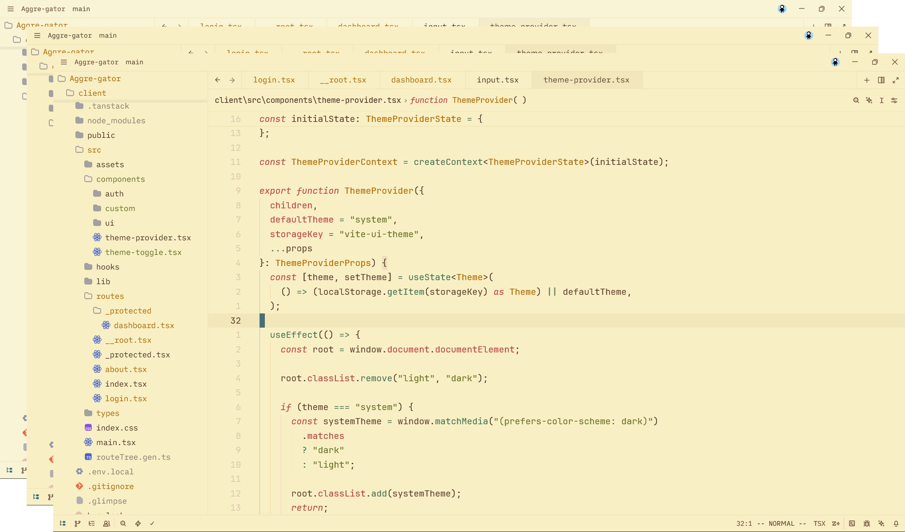
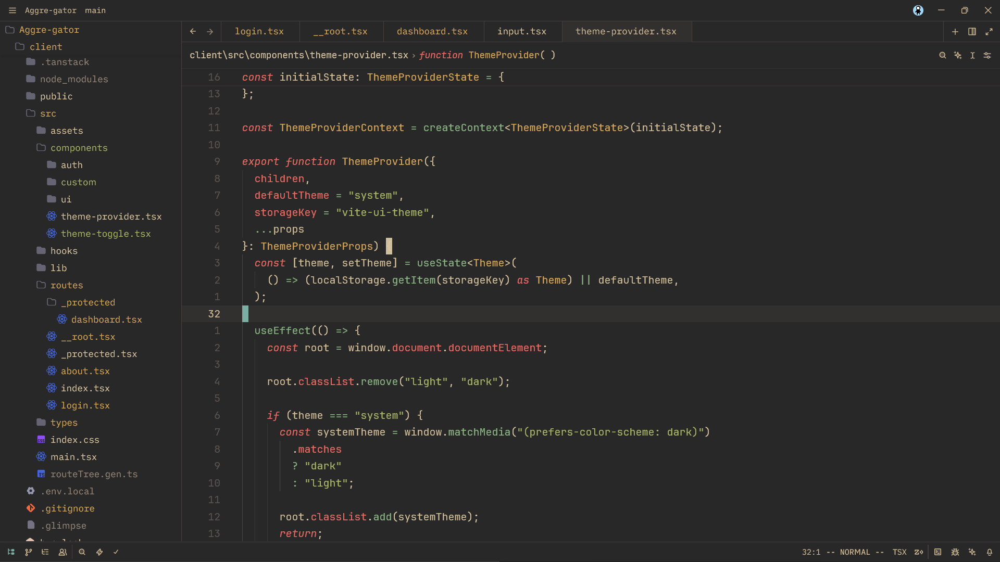
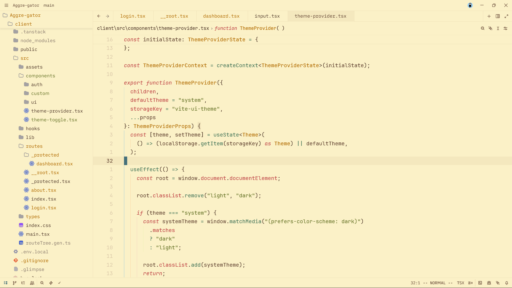

# zed-gruvbox-material
Zed Port of Gruvbox Material for (Neo)Vim. Attempted to port the original Gruvbox Material by [Sainhe](https://github.com/sainnhe/gruvbox-material).

---

Open to see individual palette preview

| Variant | Preview |
| :--- | :--- |
| **Dark Hard** |  |
| **Dark** |  |
| **Dark Mix** |  |
| **Light Hard** |  |
| **Light** |  |
| **Light Mix** |  |

## Installation

### Manual

- Move `gruvbox-material.json` to `~/.zed/themes/` or `%APPDATA%/zed/themes/`

## Thanks
- [Tokiory's Port](https://github.com/tokiory/zed-gruvbox-material)
- [Sainhe for the original Gruvbox Material](https://github.com/sainnhe/gruvbox-material)

## License

MIT